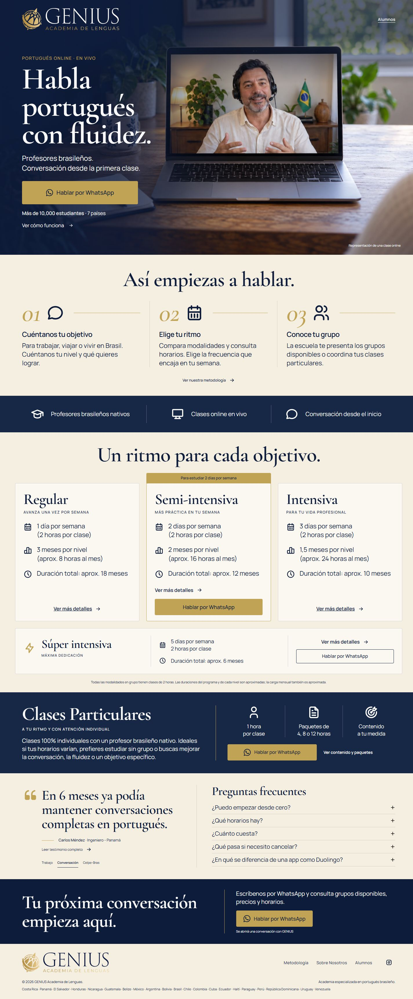
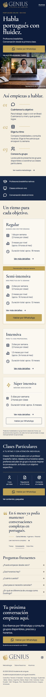

# Landing GENIUS — setembro de 2026

A home, Metodología e Sobre Nosotros usam a identidade aprovada: navy `#0B1C3A`, cream `#F6EFE3`, dourado `#C4A35A`, títulos em Cormorant Garamond e leitura em Manrope. A cena de aula do hero é uma representação ilustrativa gerada por IA, identificada pela legenda da página.

## Arquivos de produção

| Arquivo | Responsabilidade |
| --- | --- |
| `public/index.html` | Hero, três passos, modalidades com detalhes, particulares, depoimentos, cinco perguntas da FAQ e contato. |
| `public/metodologia.html` | Formatos, modalidades, prática e metodologia da escola. |
| `public/sobre-nos.html` | Apresentação, público, diferenciais e visão da escola. |
| `public/landing.css` | Tokens, componentes compartilhados e layout da home. |
| `public/inner-pages.css` / `about-page.css` | Layout e complementos das páginas internas. |
| `public/landing.js` | FAQ, depoimentos, contato, CTA fixo e animações. |
| `public/hero-gallery.js` | Alternância das três fotos do hero, seleção manual, pausa e carregamento progressivo. |
| `public/assets/hero-class-v8.webp` | Imagem do hero, 1672 × 941 pixels, 178.958 bytes. |
| `public/assets/hero-class-conversation.webp` / `hero-class-practice.webp` | Duas cenas ilustrativas adicionais, 1672 × 941 pixels; 86.846 e 97.408 bytes. |
| `public/assets/icons/` | Ícones locais e licença do Tabler. |

Os HTMLs em `public/` são a fonte de produção e podem ser editados diretamente. Não há etapa de geração de frontend nem dependência do servidor usado na exploração do design. O Docker existente copia `public/`, servido pelo Nest na raiz do site.

Os arquivos antigos `public/styles.css` e `public/script.js` permanecem disponíveis por compatibilidade com versões anteriores de páginas que ainda estejam em cache. A nova home, Metodología e Sobre Nosotros não carregam esses arquivos; nenhum loader de legado foi adicionado. Matrícula, pesquisa, dashboard e API continuam usando seus próprios arquivos e rotas.

## Contato e conteúdo

- WhatsApp: `+506 7178-4096`, com mensagem preparada para o assunto do botão. O visitante confirma o envio no WhatsApp.
- Instagram: `https://www.instagram.com/geniusacademiadelenguas/` nas três páginas e nos dados estruturados.
- Alunos: `https://geniusidiomas.q10.com/`.
- Rodapé: 21 países; a prova histórica do hero permanece “Más de 10,000 estudiantes · 7 países”. A lista geográfica não altera esse dado.
- FAQ: cinco perguntas, sem a pergunta de preparação para Celpe-Bras. Os demais conteúdos aprovados da prévia foram preservados.
- Preços e horários são consultados com a academia; nenhum valor ou avaliação foi inventado para esta atualização.

A rota `/api/leads` e os templates em `src/leads/email` são mantidos por compatibilidade com o fluxo anterior. A nova landing direciona o contato ao WhatsApp e não chama essa rota nem utiliza esses templates de email.

O CTA fixo mobile aparece após 40% de leitura quando nenhum CTA primário está visível. A FAQ abre um item por vez; depoimentos têm navegação por teclado. Animações respeitam `prefers-reduced-motion` e não bloqueiam a renderização do conteúdo principal.

Nas três páginas, o hero alterna três cenas com pessoas diferentes a cada oito segundos, mantendo título, CTA e enquadramento fixos. A passagem usa apenas opacidade por 600 ms. Os controles permitem selecionar uma foto e pausar; foco pelo teclado ou seleção manual interrompem a reprodução até uma retomada explícita. A galeria também suspende a troca quando está fora da tela, a aba fica oculta ou o mouse está sobre o hero. Com movimento reduzido, a seleção é manual e sem transição.

A primeira foto continua prioritária e funciona sem JavaScript. As outras só começam a carregar após a primeira; uma foto apenas substitui a atual quando estiver carregada e decodificada. Falhas preservam a foto visível. [Prompts e procedência das novas imagens](hero-gallery-images.md).

## Metadados e compatibilidade

As páginas de produção permitem indexação e usam `https://www.geniusidiomas.com` em canonical, Open Graph, Twitter, sitemap e robots. A verificação Google, favicons, manifest e imagem social existentes são preservados. O JSON-LD mantém a organização e as ofertas, com telefone, logo e Instagram válidos, sem os antigos placeholders e a avaliação não comprovada.

As âncoras `/#courses`, `/#contact`, `/#testimonials`, `/#methodology`, `/#main-content`, `/metodologia.html#modalidades` e `/sobre-nos.html#modalidades` continuam disponíveis. A última leva ao conteúdo de escolha de modalidade; a comparação completa fica em Metodología.

## Executar e validar

```powershell
npm run build
npm test -- --runInBand
python -m http.server 4181 --bind 127.0.0.1 --directory public
```

O servidor Python permite revisar apenas os arquivos estáticos. Para executar também a API, use o fluxo Nest e a configuração de ambiente do projeto.

Validação após a revisão: build aprovado; 17 suítes e 196 testes aprovados, incluindo 12 casos de regressão de teclado, animação, âncoras e CTA fixo; revisão das referências locais, IDs, ARIA, metadados e destinos; conferência visual em desktop e mobile. O detalhamento do conteúdo e o visual correspondem à prévia aprovada das três páginas. As decisões e correções do review estão em [landing-review.md](landing-review.md).

## Recursos visuais

Os SVGs de interface vêm de [Tabler Icons](https://github.com/tabler/tabler-icons), com cores ajustadas à marca. A licença MIT e o copyright estão em `public/assets/icons/LICENSE-tabler.txt`. O ícone do WhatsApp mantém a geometria já usada pelo site. Logos e imagem social são os recursos existentes da academia.




